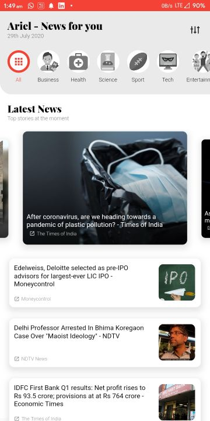
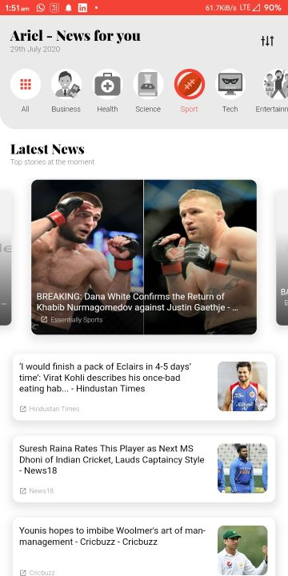
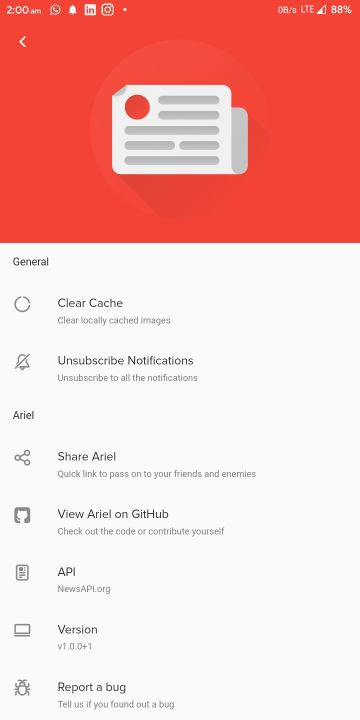
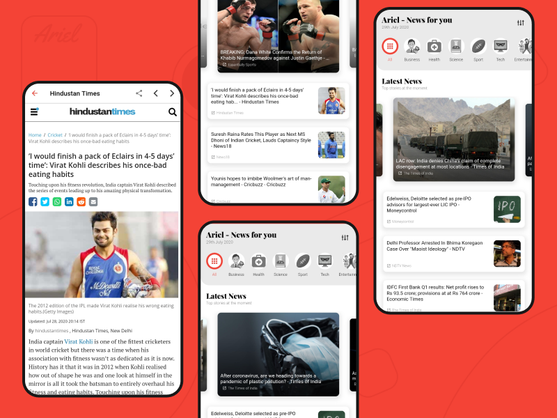

# <div align="center"> Ariel</div>

<div align="center">News App developed with Flutter featuring beautiful UI, category-based news, story for faster news reading, inbuilt article viewer, share feature, and more.


<!--  -->
<!--  -->


</div>
<a href='https://play.google.com/store/apps/details?id=com.hash.ariel-news-app&pcampaignid=pcampaignidMKT-Other-global-all-co-prtnr-py-PartBadge-Mar2515-1'></a>

Ariel offers a beautiful interface for news readers. One can simply select the category of news they want like, Business, Health, Science, Sport, Technology, Entertainment and more. If they want they can also select All categories. Then they are presented with the top five highlights of the time, and below that a list of all news events from round the world. One can just click any news they want to read it in a story manner, where they can expand the news with swipe up, go forward with right tap, go backward with left tap, read the full web article or share the story with others.

Ariel relies on [NewsAPI.org](https://newsapi.org/) API for it's source of news articles nd information. By utilizing their API, it provides the user with a fast and smooth experience filled with subtle animations and minimal design.

## List of Contents

1. [Features](#features)
2. [Demo](#demo)
3. [Support](#support)
4. [Dependencies](#dependencies)
5. [Usage](#usage)
6. [Contributing](#contributing)
7. [License](#license)
8. [Privacy Policy](#privacy)
9. [Contributors](#contributors)

## Features

- Trustworthy news articles from [NewsAPI](https://newsapi.org/)
- 6 Categories covering every bit of information possible
- In app web article viewer to read full articles on the go
- Story mode allows user to read news comfortably
- Each article comes with 100 characters short description
- Comfortable on the eyes UI
- Share news articles with one tap
- Low internet usage due to caching
- News Notifications
- Extensive settings menu with various options
- Minimal design with smooth transitions and animations
- Clear Cache with one-tap
- Optimized storage using minimal packages
- Application size under 9 MB

## Demo

**Screens**

|  |  |  |
| :-------------: | :-------------:  | :-------------:  |
|     Home    |    Story    |    Story Detail     |


|  |  |  |
| :-------------: | :-------------:  | :-------------:  |
|     Sports     |    Full Article    |    Settings     |


## Support

If you like what we do, and would want to help us continue doing it, consider sponsoring this project.

<a href="https://www.buymeacoffee.com/HashStudios" target="_blank"></a>

<!-- ariel-news-app Wallpapers app is now available on Google Play, so you can support us by reviewing the app.

<a href='https://play.google.com/store/apps/details?id=com.hash.ariel-news-app&pcampaignid=pcampaignidMKT-Other-global-all-co-prtnr-py-PartBadge-Mar2515-1'></a> -->



## Dependencies

The following packages are needed for the development of this application.

- `flutter_statusbarcolor: ^0.2.3` for changing the color of statusbar
- `flutter_webview_plugin: ^0.3.11` for in-app articles
- `firebase_core: ^0.4.5` for firebase
- `firebase_messaging: ^6.0.16` for cloud notifications
- `firebase_analytics: ^5.0.14` for user analytics
- `fluttertoast: ^4.0.1` for toast notifications
- `carousel_slider: ^2.1.0` for UI carousel slider element
- `dio: ^3.0.3` for network requests
- `video_player: ^0.10.11+2` for story videos
- `flutter_bloc: ^0.21.0` for bloc state management
- `json_serializable: ^3.2.3` for json data parsing
- `intl: ^0.16.0` for getting time
- `url_launcher: ^5.2.0` for launching url
- `sliding_up_panel: ^1.0.2
- `cached_network_image: ^2.0.0-rc` for caching wallpapers
- `fluttertoast: ^4.0.1` for toast notifications
- `share_extend: ^1.1.9` for sharing the wallpaper links
- `screenshot: ^0.2.0` for clicking screenshot

More details about these can be found in the [`pubspec.yaml`](https://github.com/Hash-Studios/ariel-news-app/tree/master/pubspec.yaml) file.

## Usage
<!-- 
The application files for Android devices can be found on [Google Play Store](https://play.google.com/store/apps/details?id=com.hash.ariel-news-app). -->

More information about the releases can be found in the [Release](https://github.com/Hash-Studios/ariel-news-app/releases) tab.

## Contributing

First off, thank you for considering contributing to Ariel. It's people like you that make Ariel such a great app.

To start your lovely journey with Ariel, first read the [`contributing guidelines`](https://github.com/Hash-Studios/ariel-news-app/tree/master/CONTRIBUTING.md) and then fork the repo to start contributing!

## License

This app is licensed under the [`BSD 3-Clause License`](https://github.com/Hash-Studios/ariel-news-app/tree/master/LICENSE.txt).
Any Usage of the source code must follow the below license.

```
BSD 3-Clause License

Copyright (c) 2020 Hash Studios
All rights reserved.

Redistribution and use in source and binary forms, with or without
modification, are permitted provided that the following conditions are met:

1. Redistributions of source code must retain the above copyright notice, this
   list of conditions and the following disclaimer.

2. Redistributions in binary form must reproduce the above copyright notice,
   this list of conditions and the following disclaimer in the documentation
   and/or other materials provided with the distribution.

3. Neither the name of the copyright holder nor the names of its
   contributors may be used to endorse or promote products derived from
   this software without specific prior written permission.

THIS SOFTWARE IS PROVIDED BY THE COPYRIGHT HOLDERS AND CONTRIBUTORS "AS IS"
AND ANY EXPRESS OR IMPLIED WARRANTIES, INCLUDING, BUT NOT LIMITED TO, THE
IMPLIED WARRANTIES OF MERCHANTABILITY AND FITNESS FOR A PARTICULAR PURPOSE ARE
DISCLAIMED. IN NO EVENT SHALL THE COPYRIGHT HOLDER OR CONTRIBUTORS BE LIABLE
FOR ANY DIRECT, INDIRECT, INCIDENTAL, SPECIAL, EXEMPLARY, OR CONSEQUENTIAL
DAMAGES (INCLUDING, BUT NOT LIMITED TO, PROCUREMENT OF SUBSTITUTE GOODS OR
SERVICES; LOSS OF USE, DATA, OR PROFITS; OR BUSINESS INTERRUPTION) HOWEVER
CAUSED AND ON ANY THEORY OF LIABILITY, WHETHER IN CONTRACT, STRICT LIABILITY,
OR TORT (INCLUDING NEGLIGENCE OR OTHERWISE) ARISING IN ANY WAY OUT OF THE USE
OF THIS SOFTWARE, EVEN IF ADVISED OF THE POSSIBILITY OF SUCH DAMAGE.
```

```
DISCLAIMER: Google Play and the Google Play logo are trademarks of Google LLC.
```
## Privacy

Link to the full privacy policy can be found [here](https://github.com/Hash-Studios/ariel-news-app/tree/master/PRIVACY.md).

**Privacy Policy**

Hash Studios built the ariel-news-app app as an Open Source app. This SERVICE is provided by Hash Studios at no cost and is intended for use as is.

This page is used to inform visitors regarding our policies with the collection, use, and disclosure of Personal Information if anyone decided to use our Service.

If you choose to use our Service, then you agree to the collection and use of information in relation to this policy. The Personal Information that we collect is used for providing and improving the Service. We will not use or share your information with anyone except as described in this Privacy Policy.

The terms used in this Privacy Policy have the same meanings as in our Terms and Conditions, which is accessible at ariel-news-app unless otherwise defined in this Privacy Policy.

**Information Collection and Use**

For a better experience, while using our Service, we may require you to provide us with certain personally identifiable information, including but not limited to name, email, profile image. The information that we request will be retained by us and used as described in this privacy policy.

The app does use third party services that may collect information used to identify you.

Link to privacy policy of third party service providers used by the app

*   [Google Play Services](https://www.google.com/policies/privacy/)
*   [Google Analytics for Firebase](https://firebase.google.com/policies/analytics)
*   [Firebase Crashlytics](https://firebase.google.com/support/privacy/)

**Log Data**

We want to inform you that whenever you use our Service, in a case of an error in the app we collect data and information (through third party products) on your phone called Log Data. This Log Data may include information such as your device Internet Protocol (“IP”) address, device name, operating system version, the configuration of the app when utilizing our Service, the time and date of your use of the Service, and other statistics.

**Cookies**

Cookies are files with a small amount of data that are commonly used as anonymous unique identifiers. These are sent to your browser from the websites that you visit and are stored on your device's internal memory.

This Service does not use these “cookies” explicitly. However, the app may use third party code and libraries that use “cookies” to collect information and improve their services. You have the option to either accept or refuse these cookies and know when a cookie is being sent to your device. If you choose to refuse our cookies, you may not be able to use some portions of this Service.

**Service Providers**

We may employ third-party companies and individuals due to the following reasons:

*   To facilitate our Service;
*   To provide the Service on our behalf;
*   To perform Service-related services; or
*   To assist us in analyzing how our Service is used.

We want to inform users of this Service that these third parties have access to your Personal Information. The reason is to perform the tasks assigned to them on our behalf. However, they are obligated not to disclose or use the information for any other purpose.

**Security**

We value your trust in providing us your Personal Information, thus we are striving to use commercially acceptable means of protecting it. But remember that no method of transmission over the internet, or method of electronic storage is 100% secure and reliable, and we cannot guarantee its absolute security.

**Links to Other Sites**

This Service may contain links to other sites. If you click on a third-party link, you will be directed to that site. Note that these external sites are not operated by us. Therefore, we strongly advise you to review the Privacy Policy of these websites. We have no control over and assume no responsibility for the content, privacy policies, or practices of any third-party sites or services.

**Children’s Privacy**

These Services do not address anyone under the age of 13. We do not knowingly collect personally identifiable information from children under 13\. In the case we discover that a child under 13 has provided us with personal information, we immediately delete this from our servers. If you are a parent or guardian and you are aware that your child has provided us with personal information, please contact us so that we will be able to do necessary actions.

**Changes to This Privacy Policy**

We may update our Privacy Policy from time to time. Thus, you are advised to review this page periodically for any changes. We will notify you of any changes by posting the new Privacy Policy on this page.

This policy is effective as of 2020-07-18

**Contact Us**

If you have any questions or suggestions about our Privacy Policy, do not hesitate to contact us at hash.studios.inc@gmail.com.

## Contributors

<a href="https://github.com/Hash-Studios/ariel-news-app/graphs/contributors">
  
</a>

## If you made it here, thanks for your support. You can show more support by forking or starring this repo. Thanks forever.
